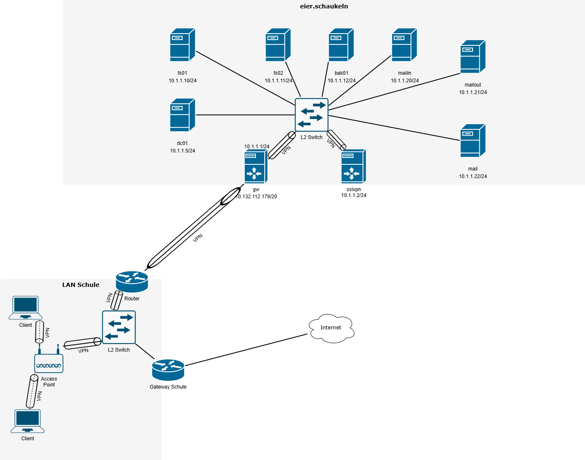
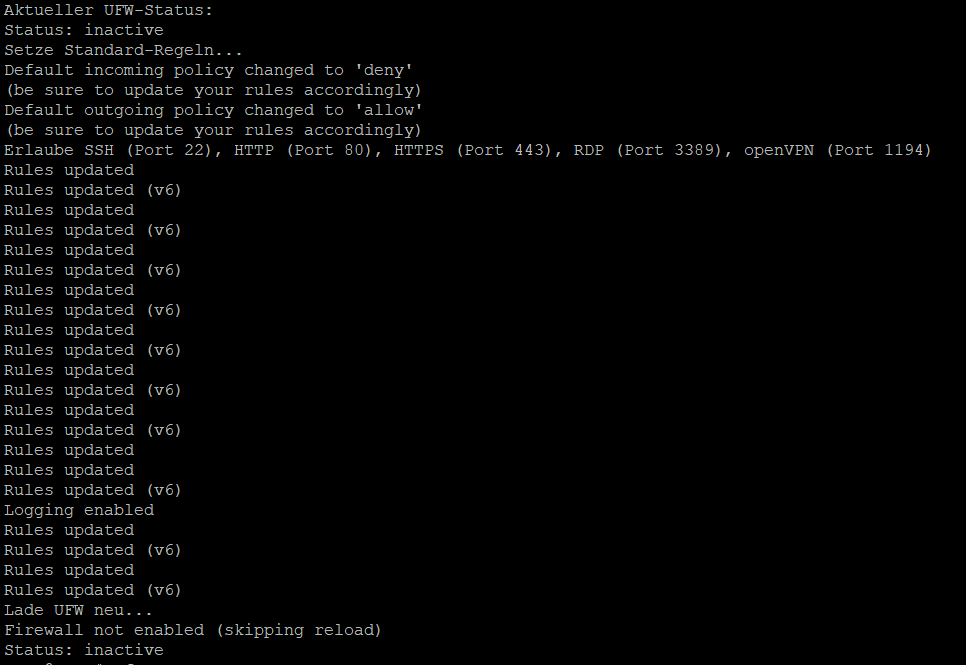
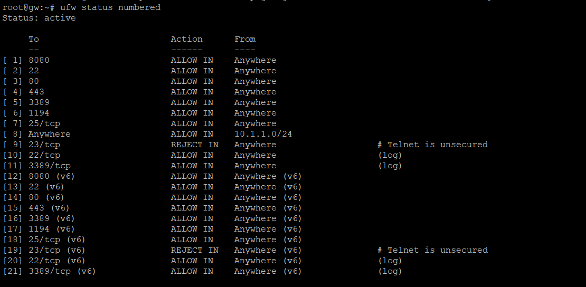

# Linux Level 3 Dokumentation

## Inhaltsverzeichnis

- [Netzwerkplan](#netzwerkplan)
- [Active Directory Setup](#active-directory-setup)
- [VPN Server Setup](#vpn-server-setup)
- [Firewall](#firewall)
- [Mail-Server (mit Mail-in und Mail-out)](#mail-server-mit-mail-in-und-mail-out)
- [File-Server und Backup](#file-server-und-backup)

## Netzwerkplan



## Active Directory Setup

### Netzwerkkonfiguration

```bash
nano /etc/network/interfaces     # Netzwerkschnittstellen bearbeiten
service networking restart       # Netzwerkdienste neu starten
ip a                             # IP-Adressen und Netzwerkschnittstellen anzeigen
ping 8.8.8.8                     # Verbindung zu Google DNS prüfen
hostname -A                      # Vollständigen Hostnamen anzeigen
nano /etc/hostname               # Hostnamen konfigurieren
cat /etc/hostname                # Hostnamen anzeigen
nano /etc/hosts                  # Lokale Hostdatei bearbeiten
```

### SSH-Konfiguration

```bash
nano /etc/ssh/sshd_config        # SSH-Serverkonfiguration bearbeiten
service sshd restart             # SSH-Dienst neu starten
```

### Paketverwaltung

```bash
apt update                       # Paketliste aktualisieren
apt upgrade -y                   # Systempakete aktualisieren
sudo apt-get update              # Alternative zu apt update
apt-get update                   # Noch eine Variante
apt install sudo                 # sudo installieren (wenn nicht vorhanden)
```

### DNS und Namensauflösung

```bash
ping -c1 dc01.eier.schaukeln     # DNS-Auflösung testen
nslookup                         # DNS-Abfrage starten
nslookup dns.google              # DNS-Serverabfrage
nslookup dns.google 1.1.1.1      # DNS-Abfrage über spezifischen Server
unlink /etc/resolv.conf          # DNS-Konfigurationsdatei entfernen
sudo unlink /etc/resolv.conf     # Mit Root-Rechten entfernen
nano /etc/resolv.conf            # DNS-Konfiguration bearbeiten
sudo nano /etc/resolv.conf       # Als Root bearbeiten
```

### systemd-resolved deaktivieren

```bash
sudo systemctl disable --now systemd-resolved   # Dienst sofort stoppen und deaktivieren
systemctl disable --now systemd-resolved
systemctl disable systemd-resolved
systemctl disable resolved
systemctl stop systemd-resolved
```

### Netzwerke neu starten

```bash
service systemd-networkd restart                # systemd-Netzwerkdienst neu starten
service networking restart                      # Netzwerkdienste neu starten
```

### UFW – Firewallstatus prüfen

```bash
ufw status                                      # Status der UFW-Firewall anzeigen
```

### Samba Active Directory Einrichtung

```bash
sudo apt install -y acl attr samba samba-dsdb-modules samba-vfs-modules \
smbclient winbind libpam-winbind libnss-winbind libpam-krb5 krb5-config \
krb5-user dnsutils chrony net-tools
```

```bash
sudo systemctl disable --now smbd nmbd winbind                # Alte Samba-Dienste stoppen
sudo systemctl unmask samba-ad-dc                             # AD-Modus freischalten
sudo systemctl enable samba-ad-dc                             # AD-Dienst aktivieren
sudo mv /etc/samba/smb.conf /etc/samba/smb.conf.bak           # Alte Konfig sichern
sudo mv /etc/krb5.conf /etc/krb5.conf.bak
sudo samba-tool domain provision --use-rfc2307 --interactive  # AD Domain einrichten
sudo cp /var/lib/samba/private/krb5.conf /etc/krb5.conf       # Neue Kerberos-Datei übernehmen
sudo systemctl start samba-ad-dc
sudo systemctl status samba-ad-dc
```

### Samba testen

```bash
smbclient //localhost/netlogon -U Administrator -c 'ls'       # Verbindung testen
```

### DNS-Tests & Kerberos

```bash
host -t SRV _ldap._tcp.eier.schaukeln
host -t SRV _kerberos._udp.eier.schaukeln
host -t A dc01.eier.schaukeln
kinit administrator                                           # Kerberos-Ticket abrufen
klist                                                         # Kerberos-Tickets anzeigen
```

### Benutzer- & Gruppenverwaltung

```bash
sudo samba-tool user create konsti Konsti-9012!
sudo samba-tool user list
sudo samba-tool user edit konsti
sudo samba-tool user setpassword konsti
sudo samba-tool user add leon
sudo samba-tool user add ben
```

```bash
sudo samba-tool group list
sudo samba-tool group add FileAdmin
sudo samba-tool group add Admins
sudo samba-tool group add VPNAdmin
sudo samba-tool group add GatewayAdmin
sudo samba-tool group addmembers Admins konsti
sudo samba-tool group addmembers Domain\ Admins konsti
sudo samba-tool group addmember GatewayAdmins ben
```

### AD-Objekte & GPO-Verwaltung

```bash
sudo samba-tool computer list
sudo samba-tool ou list
sudo samba-tool gpo list
sudo samba-tool gpo create sudoersfile
sudo samba-tool gpo manage sudoers add domain\ admins ALL ALL
sudo samba-tool gpo manage sudoers list
```

### Sonstige Tools & Tests

```bash
pam-auth-update --help     # PAM-Authentifizierungs-Hilfe anzeigen
realm                      # Domain-Join Informationen anzeigen
exit                       # Sitzung verlassen
```

### Client installation

[AutoFS](install_autofs.sh)

### Grundlegende Netzwerkprüfung

```bash
ping 10.1.1.X
ip a
```

### Hostname und SSH-Konfiguration

```bash
nano /etc/hostname
hostname
reboot
```

```bash
nano /etc/ssh/sshd_config
service sshd restart
```

### Paketverwaltung und Updates

```bash
apt update
apt upgrade
apt-get update
apt-get install -y sssd-ad sssd-tools realmd adcli sudo
apt-get install -y krb5-user sssd-krb5 packagekit
```

### Kerberos-Konfiguration

```bash
cat <<EOF > /etc/krb5.conf
[libdefaults]
default_domain = EIER.SCHAUKELN
rdns = false
EOF
```

### DNS-Konfiguration

```bash
cat <<EOF > /etc/resolv.conf
nameserver 10.1.1.5
nameserver 10.130.255.254
search eier.schaukeln
EOF
```

### Benutzer authentifizieren

```bash
kinit konsti@EIER.SCHAUKELN
realm join -v -U konsti EIER.SCHAUKELN
```

### Sudo-Konfiguration

```bash
cat <<EOF > /etc/sudoers
# (Standard sudoers-Konfiguration)
# ...
%sudo   ALL=(ALL:ALL) ALL
%domain\ admins@eier.schaukeln ALL=(ALL) NOPASSWD:ALL

@includedir /etc/sudoers.d
EOF
```

### PAM konfigurieren

```bash
pam-auth-update
```

### Verlauf anzeigen

```bash
history
```

## VPN Server Setup

### Install OpenVPN and Easy-RSA

```bash
apt update
apt upgrade -y
sudo apt install openvpn easy-rsa
```

### OpenVPN Server Certificate Authority (CA) Setup

```bash
make-cadir /etc/openvpn/easy-rsa                            # Erstellt ein neues Easy-RSA-Arbeitsverzeichnis
/etc/openvpn/easy-rsa/easyrsa init-pki                      # Initialisiert die PKI (Public Key Infrastructure)
/etc/openvpn/easy-rsa/easyrsa build-ca                      # Erstellt ein neues Root-Zertifikat
/etc/openvpn/easy-rsa/easyrsa build-server-full server      # Erstellt ein Server-Zertifikat und den dazugehörigen privaten Schlüssel für den OpenVPN-Server
/etc/openvpn/easy-rsa/easyrsa gen-dh                        # Generiert die Diffie-Hellman-Parameter
openvpn --genkey secret /etc/openvpn/server/ta.key          # Erstellt einen TLS-Authentifizierungs-Schlüssel
```

### IP Forwarding (/etc/sysctl.conf)

Um IP Forwarding zu aktivieren, die Datei `/etc/sysctl.conf` bearbeiten und die folgende Zeile hinzufügen oder einkommentieren:

```text
net.ipv4.ip_forward=1
```

### Create Client Files

```bash
/etc/openvpn/easy-rsa/easyrsa gen-req {client} nopass       # Erstellt eine Zertifikatsanforderung für den Client
/etc/openvpn/easy-rsa/easyrsa sign-req client {client}      # Signiert die Zertifikatsanforderung für den Client
```

### Client Files Location on Server after Creation

Ort der Client-Dateien auf dem Server nach der Erstellung:

```text
/etc/openvpn/server/client.conf
/etc/openvpn/easy-rsa/pki/ca.crt
/etc/openvpn/easy-rsa/pki/issued/{client}.crt
/etc/openvpn/easy-rsa/pki/private/{client}.key
/etc/openvpn/server/ta.key
```

### Server Files

Wichtige Server-Dateien, die für den OpenVPN-Server benötigt werden:

```text
/etc/openvpn/server.conf
/etc/openvpn/easy-rsa/pki/ca.crt
/etc/openvpn/easy-rsa/pki/issued/server.crt
/etc/openvpn/easy-rsa/pki/private/server.key
/etc/openvpn/easy-rsa/pki/dh.pem
/etc/openvpn/server/ta.key
```

### Server Config File (/etc/openvpn/server.conf)

```text
port 1194
proto udp
dev tun

ca      /etc/openvpn/easy-rsa/pki/ca.crt
cert    /etc/openvpn/easy-rsa/pki/issued/server.crt
key     /etc/openvpn/easy-rsa/pki/private/server.key  # keep secret
dh      /etc/openvpn/easy-rsa/pki/dh.pem

topology subnet

server 10.9.8.0 255.255.255.0  # internal tun0 connection IP
ifconfig-pool-persist ipp.txt

push "route 192.168.0.0 255.255.255.0"
push "redirect-gateway def1 bypass-dhcp"

keepalive 10 120

tls-auth /etc/openvpn/server/ta.key 0
auth-nocache

cipher AES-256-GCM
data-ciphers AES-256-GCM

persist-key
persist-tun

status /var/log/openvpn/openvpn-status.log

verb 3  # verbose mode

client-to-client
explicit-exit-notify 1
```

### Client Config File (/etc/openvpn/server/client.conf)

```text
##############################################
# Sample client-side OpenVPN 2.0 config file #
# for connecting to multi-client server.     #
#                                            #
# This configuration can be used by multiple #
# clients, however each client should have   #
# its own cert and key files.                #
#                                            #
# On Windows, you might want to rename this  #
# file so it has a .ovpn extension           #
##############################################

# Specify that we are a client and that we
# will be pulling certain config file directives
# from the server.
client

# Use the same setting as you are using on
# the server.
# On most systems, the VPN will not function
# unless you partially or fully disable
# the firewall for the TUN/TAP interface.
;dev tap
dev tun

# Windows needs the TAP-Win32 adapter name
# from the Network Connections panel
# if you have more than one.  On XP SP2,
# you may need to disable the firewall
# for the TAP adapter.
;dev-node MyTap

# Are we connecting to a TCP or
# UDP server?  Use the same setting as
# on the server.
;proto tcp
proto udp

# The hostname/IP and port of the server.
# You can have multiple remote entries
# to load balance between the servers.
remote 10.132.112.179 1194
;remote my-server-2 1194

# Choose a random host from the remote
# list for load-balancing.  Otherwise
# try hosts in the order specified.
;remote-random

# Keep trying indefinitely to resolve the
# host name of the OpenVPN server.  Very useful
# on machines which are not permanently connected
# to the internet such as laptops.
resolv-retry infinite

# Most clients don't need to bind to
# a specific local port number.
nobind

# Downgrade privileges after initialization (non-Windows only)
;user openvpn
;group openvpn

# Try to preserve some state across restarts.
persist-key
persist-tun

# If you are connecting through an
# HTTP proxy to reach the actual OpenVPN
# server, put the proxy server/IP and
# port number here.  See the man page
# if your proxy server requires
# authentication.
;http-proxy-retry # retry on connection failures
;http-proxy [proxy server] [proxy port #]

# Wireless networks often produce a lot
# of duplicate packets.  Set this flag
# to silence duplicate packet warnings.
;mute-replay-warnings

# SSL/TLS parms.
# See the server config file for more
# description.  It's best to use
# a separate .crt/.key file pair
# for each client.  A single ca
# file can be used for all clients.
ca ca.crt
cert {client}.crt
key {client}.key

# Verify server certificate by checking that the
# certificate has the correct key usage set.
# This is an important precaution to protect against
# a potential attack discussed here:
#  http://openvpn.net/howto.html#mitm
#
# To use this feature, you will need to generate
# your server certificates with the keyUsage set to
#   digitalSignature, keyEncipherment
# and the extendedKeyUsage to
#   serverAuth
# EasyRSA can do this for you.
remote-cert-tls server

# If a tls-auth key is used on the server
# then every client must also have the key.
tls-auth ta.key 1

# Select a cryptographic cipher.
# If the cipher option is used on the server
# then you must also specify it here.
# Note that v2.4 client/server will automatically
# negotiate AES-256-GCM in TLS mode.
# See also the data-ciphers option in the manpage
cipher AES-256-GCM

# Enable compression on the VPN link.
# Don't enable this unless it is also
# enabled in the server config file.
#comp-lzo

# Set log file verbosity.
verb 3

# Silence repeating messages
;mute 20
```

## Firewall

### installieren der Firewall

> Gewählt wurde die __"Uncomplicated Firewall"__(UFW)

``` bash
sudo su -
apt install ufw -y
ufw status verbose
```

### Standartregeln setzen

``` bash
ufw default deny incoming
ufw default allow outgoing
```

### Ports zulassen

``` bash
ufw allow 8080
ufw allow 22
ufw allow 80
ufw allow 443
ufw allow 3389
ufw allow 1194
ufw allow smtp
ufw allow from 10.1.1.0/24
```

### Ports deaktivieren

``` bash
ufw reject telnet comment 'Telnet is unsecured'
```

### Logging der SSH und RDP aktivieren

``` bash
ufw logging on
ufw allow log 22/tcp
ufw allow log 3389/tcp
```

### UFW neuladen und status anzeigen

``` bash
ufw reload
ufw status verbose
```

### Ausführung



### Routingtabelle



## Mail-Server (mit Mail-in und Mail-out)

Install von Mailsoftware (auch bei dem Mail-in, Mail-out)

``` bash
apt update && apt install postfix rspamd clamav clamav-daemon mailutils
```

### Postfix Configuration


### Konfigurationsdatei bearbeiten /etc/postfix/main.cf (bei dem Mail-in, Mail-out andere Domain eintragen)

``` bash
nano /etc/postfix/main.cf

myhostname = mail.eier.schaukeln
mydomain = mail.eier.schaukeln
myorigin = $mydomain
inet_interfaces = loopback-only  # Nur lokale Verbindungen erlauben
mydestination = $myhostname, localhost.$mydomain, localhost, $mydomain
relayhost =  # (Leer lassen, kein Forwarding)
mynetworks = 127.0.0.0/8  # Nur localhost darf Mails senden
```

### Hostname setzen (auch bei dem Mail-in, Mail-out)

``` bash
sudo hostnamectl set-hostname mail.eier.schaukeln

```

``` bash
nano /etc/hosts

127.0.1.1 mail.eier.schaukeln

```

### Postfix neu starten

``` bash
sudo systemctl restart postfix
```

### Testmail mit lokalen User

``` bash
adduser user1

echo "Testmail-Inhalt" | mail -s "Testbetreff" user1@mail.eier.schaukeln  
```


## File-Server und Backup

### FIL01 - Samba Client & Benutzerverwaltung

```bash
sudo su
smbclient -L //10.1.1.10 -k           # Zugriff auf Samba-Freigaben mit Kerberos (-k)
sudo pdbedit -L
smbclient -L //10.1.1.10
ssh fs01
sudo apt-get install rsync
rsync -a Quellverzeichnis Zielverzeichnis  # Rsync für Datei-Synchronisation nutzen
ssh fs02
nano /etc/samba/smb.conf
sudo nano /etc/samba/smb.conf
sudo systemctl restart smbd               # Samba-Konfiguration bearbeiten und Dienst neu starten
sudo nano backup_FL01.sh                   # Backup-Skript erstellen
mv backup_FL01.sh /usr/local/bin/backup_FL01.sh
sudo mv backup_FL01.sh /usr/local/bin/backup_FL01.sh
```

### SMB.Config - Samba Konfiguration (Beispiel)

```ini
 idmap config * : backend = tdb            ; ID-Mapping und Realm-Konfiguration für AD-Integration
 idmap config * : range = 10000-999999
 idmap config EIER : backend = rid
 idmap config EIER : range = 10000-99999
 realm = EIER.SCHAUKELN
 workgroup = EIER
 idmap config EIER : range = 2000000-2999999
 idmap config EIER : backend = rid
 winbind refresh tickets = yes
 winbind offline logon = yes

[freigabe]
   path = /srv/samba/freigabe
   browseable = yes
   read only = no
   writable = yes
   valid users = "@EIER.SCHAUKELN\Domain Users"  ; Freigaben definieren: freigabe

[homes]
   path = /srv/samba/homes
   comment = Home Directories
   browseable = yes
   read only = no
   creat mask = 0700
   writable = yes                                  #; Freigaben definieren: homes
```

### FIL02 - Netzwerk & Samba

```bash
su konsti@eier.schaukeln
nano /etc/samba/smb.conf
cp /etc/samba/smb.conf /etc/samba/smb.conf.old
echo "" > /etc/samba/smb.conf                       # smb.conf leeren
mkdir /srv/samba/freigabe
service samba-ad-dc restart
service samba-ad-dc status
```

### BAK01 - Backup Setup & SSH Keys

```bash
sudo mkdir -p /backups/server1
sudo mkdir -p /backups/10.1.1.12
sudo chown -R backupuser:backupuser /backups          # Backup-Verzeichnisse anlegen mit korrekten Rechten
sudo chown -R backup-user@eier.schaukeln /backups
sudo chown -R backup-user@eier.schaukeln:fileadmin@eier.schaukeln /backups
ssh-keygen -t rsa
ssh-copy-id backup-user@eier.schaukeln                  # SSH-Key-Setup für passwortlose Authentifizierung
nano backupskript
sudo mkdir -p /backup/FL01
sudo mkdir -p /backup/FL02
sudo mkdir -p /backup/SSLVPN
sudo mkdir -p /backup/DC01
sudo mkdir -p /backup/mailin
sudo mkdir -p /backup/mailout
sudo mkdir -p /backup/mail
sudo mkdir -p /backup/GW
chmod +x /usr/local/bin/backup.sh
sudo chmod +x /usr/local/bin/backup.sh                   # Backup-Skript erstellen, ausführbar machen
crontab -e

sudo nano /usr/local/bin/backup.sh                       # Verzeichnis für Backup Skript erstellen und öffnen 

#!/bin/bash                                              # Backup Skript, ist beim Hostname jeweil für den jeweiligen Server angepasst

# ===============================
# Backup-Skript für Server fs01
# ===============================

# --- Konfiguration ---
HOSTNAME="fs01"
SRC_DIR="/srv/files"
DEST_USER="backupuser@eier.schaukeln"
DEST_HOST="10.1.1.12"
DEST_DIR="/backup/$HOSTNAME"
DATE=$(date +%F)
LOGFILE="/var/log/backup_$HOSTNAME.log"

# --- Backup ausführen ---
echo "[$(date)] Backup startet..." >> $LOGFILE

rsync -azP --delete "$SRC_DIR" "$DEST_USER@$DEST_HOST:$DEST_DIR/$DATE" >> $LOGFILE 2>&1

# --- Erfolg prüfen ---
if [ $? -eq 0 ]; then
    echo "[$(date)] Backup erfolgreich abgeschlossen." >> $LOGFILE
else
    echo "[$(date)] Fehler beim Backup!" >> $LOGFILE
fi

sudo crontab -e -u backupuser@eier.schaukeln                                # Editieren des Crontabs als Backup-User

0 2 * * * /usr/local/bin/backup.sh >> /var/log/backup.log 2>&1              # Crontab Zeit vorgeben wann er durchläuft und wo dieser gespeichert wird
´´´
